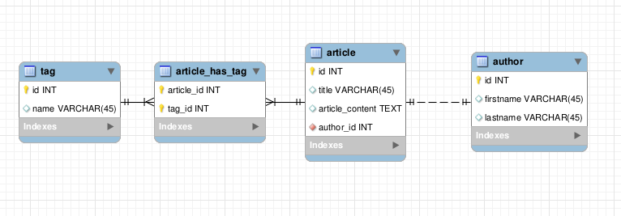

Getting Started
===============

This getting started will learn you the very basics of Face.
It's nothing more than a starting point that will show you how the library works by the examples.

Requirements
------------

This guide requires you to have the minimum knowledge of a relational database. In addition you should prepare :

 - A mysql database (for the early development, Face only supports mysql, however more are planned thanks to the flexibility of PDO)
 - A set of sql schema ready in the database : :download:`schema.sql <../resources/getting_started_schema.sql>`.
 - The Face library ready for use (check the installation guide)

First Step : Get data from the database
---------------------------------------

The schema required for this guide is the following :

In this first step we are going to query some articles from the database

Create a model for articles
^^^^^^^^^^^^^^^^^^^^^^^^^^^

