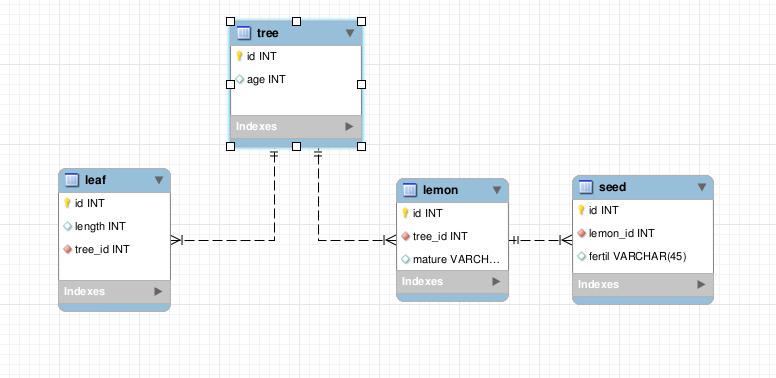

Basic Operations
===========

This section treats of the basical CRUD operations (create read update delete).

.. note::

    Face is under early beta phase and only reading (Select) are supported.

Introduction
------------

All the examples use the following model :

A sql script including some data identical to the one used for the following examples is available here : :download:`lemon-model.sql <../resources/lemon-model.sql>`.

We consider that you know how to generate the models for your project. If no have a look at the :doc:`models generations <../installation/generation>` section

All the following examples include the ``$pdo`` variable already instantiated :

.. code-block:: php

    // All Face access to the database are made through a PDO object
    $pdo = new PDO('mysql:host=localhost;dbname=lemon-test', 'root', 'root');

Select
-------------

If your database and your models are ready, lets select some datas.

Simple Select
.............

.. code-block:: php

    // create a query to find all trees in the database
    $fQuery = Tree::faceQueryBuilder();

    // execute the query through the pdo object
    $trees = Face\ORM::execute($fQuery, $pdo);

    // you can count the number of results as a regular array
    $numberOfTrees = count($trees);

    // you can also iterate over the trees
    foreach($trees as $tree){

        // you can get the age of the tree
        echo $tree->getAge() . "years - ";

    }

Select with where clause
.............

Face offers a SQL like way to write where clauses. You just have to add a tilde [~] for Face to understand that you want him to treat the following expression.

.. code-block:: php

    // create a query to find all trees that have 5 years or more
    $fQuery = Tree::faceQueryBuilder();
    $fQuery->where("~age >= :age");

    // you can call bind values like with pdo
    $fQuery->bindValue(":age" , 5 , PDO::PARAM_INT);

    // execute the query through the pdo object
    $trees = Face\ORM::execute($fQuery, $pdo);

    foreach($trees as $tree){
        echo $tree->getAge() . "years - ";
    }

Select and Join entities
.............

Face uses path for navigation over the properties. All is explained in the :doc:`core section <../usage/core>`

You can join elements just by their path. Usually it will be the property name of the related Class.

.. code-block:: php

    // create a query to find all trees and join the lemons
    $fQuery = Tree::faceQueryBuilder();
    $fQuery->join("Lemon");

    // execute the query through the pdo object
    $trees = Face\ORM::execute($fQuery, $pdo);

    // you still can count the number of trees
    $numberOfTrees = count($trees);

    // you can also get all the lemons
    $allLemons = $trees->getInstancesByClass("Lemon");

Select + Join + Where
.............

Once you have joined entites, you can do deeper where clauses. See :

.. code-block:: php

    $fQuery = Tree::faceQueryBuilder()
        ->join("Lemon")
        ->join("Leaf")
        ->join("Lemon.Seed")
        // we only want the
        ->where("~age >= :age  AND  ~Lemon.Seed.fertil=1 ");
        ->bindValue(":age", 5 , PDO::PARAM_INT);

    // execute the query through the pdo object
    $trees = Face\ORM::execute($fQuery, $pdo);